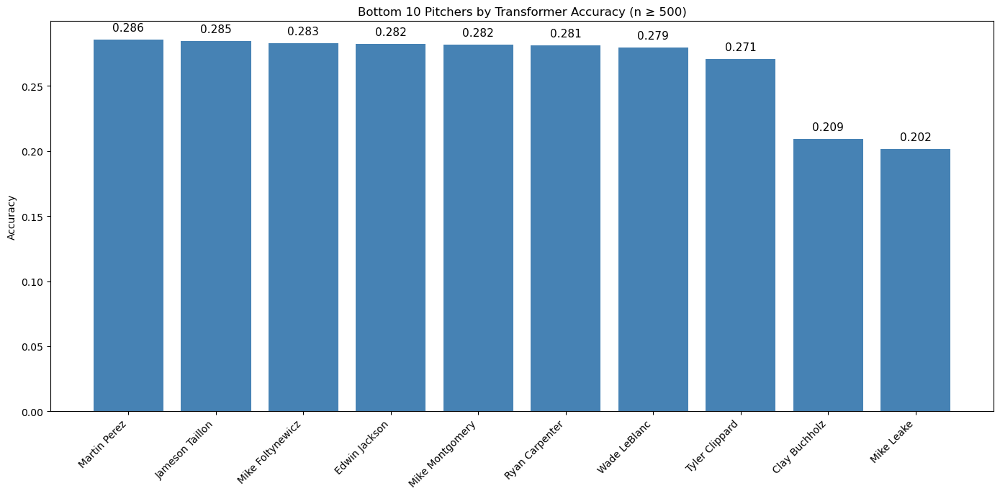
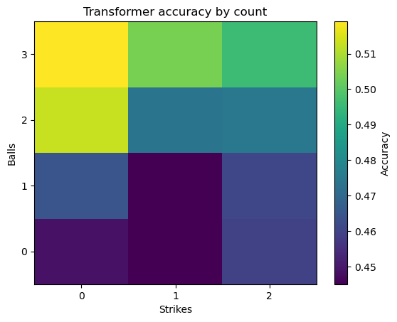

# Next Pitch Prediction in Major League Baseball Using Transformer Models

## Author: Liam Bowen
## School: Vanderbilt University
## Course: Generative AI Models in Theory & Practice

## Summary

This repository contains a complete, end-to-end pipeline for predicting the next pitch type in Major League Baseball using Transformer sequence models.

Pitch sequences are treated like language tokens. The model learns:

```math
P(\text{next pitch} \mid \text{previous pitches + context})
```

## Table of Contents
- [Overview](#overview)
- [Methodology](#methodology)
- [Implementation & Demo](#implementation)
- [Assessment & Evaluation](#evaluation)
- [Model & Data Cards](#model--data-cards)
- [Critical Analysis](#critical-analysis)
- [Resources](#resources)

## Overview

Major League Baseball generates millions of pitches each season, yet predicting what pitch is coming next will always be one of the hardest problems in baseball analytics. Understanding pitch sequencing has value for:
- Hitters and coaches preparing for opponents
- Broadcasters explaining strategy
- Betting and forecasting models
- Player development and scouting

### Problem Statement:
Can we accurately predict the next pitch type thrown in an MLB at-bat using modern sequence-modeling techniques, specifically Transformer architectures. How does this approach compare to simpler baselines such as logistic regression?

This project builds a complete, end-to-end system for MLB pitch prediction, including data preprocessing, pitch tokenization, a logistic regression baseline, a custom Transformer model, uncertainty calibration, and multiple evaluation analyses.

## Methodology
This project follows a structured machine learning pipeline:

1. Data Preparation
  - Loaded MLB pitch-by-pitch data
  - Filtered and cleaned variables relevant for pitch sequencing:
      - pitch type
      - count (balls/strikes)
      - pitcher ID
      - contextual features (score, inning, first pitch of at bat, etc.)
  - Mapped pitch types to integer tokens (FF -> 5, SL -> 15)
   
2. Baseline Model: Multiclass Logistic Regression
  - Inputs:
      - Pitch Tokens (last 32 pitch types thrown by that pitcher)
      - Pitch count (balls/strikes)
      - Game state (score differential)
  - Outputs: probabilites over 17 pitch types
  - Evaluated using:
      - Top-1 Accuracy
      - Top-3 Accuracy
      - Brier Score
      - Expected Calibration Error (ECE)

3. Transformer Pitch-Sequence Model
  - Custom PyTorch implementation
  - Encodes pitch history for each pitcher as a sequence
  - Uses embeddings for:
      - Pitch tokens
      - Balls
      - Strikes
      - First-pitch flag
      - Pitcher ID (To learn pitcher-specific tendencies)
      - Score differential
      - Inning
      - Outs
      - Runners on base
      - Pitcher handedness
      - Batter handedness
  - 4-head self-attention
  - 2 Transformer decoder layers
  - Sequence length = 32
  - Output: softmax over 17 pitch types

4. Model Calibration
  Transformers often output overconfident probabilities, so we apply:
    - Temperature scaling
    - Reliability diagrams
    - Before/after ECE & Brier score comparison

5. Evaluation
   We conduct a wide range of analyses:
     - Top-k accuracy
     - Pitch-type-specific accuracy
     - Count-based accuracy heatmaps
     - Per-pitcher model performance
     - Calibration curves
  

## Implementation & Demo

This section demonstrates how to load the model, run predictions, and visualize calibration.

1. Load Model & Data
```python
import torch
from model import PitchTransformer
from data import load_test_set

device = "cuda" if torch.cuda.is_available() else "cpu"

model = PitchTransformer.load_from_checkpoint("checkpoints/transformer_best.pt")
model = model.to(device).eval()

X_test, y_test = load_test_set()

```

2. Generate Predictions
```python
with torch.no_grad():
    logits = model(X_test.to(device))
    probs  = torch.softmax(logits, dim=1)
    preds  = probs.argmax(dim=1).cpu().numpy()
```

3. Example Prediction
```python
sample = 42
print("Previous pitches:", X_test['pitch_tokens'][sample])
print("True next pitch:", y_test[sample])
print("Predicted:", preds[sample])
print("Probabilities:", probs[sample])
```

Example output:
```less
Previous pitches: ['FF', 'SL', 'SL']
True next pitch: FF
Predicted: FF
Probabilities: [0.02, 0.45, 0.38, ...]
```

4. Compute Test Accuracy
```python
import numpy as np

acc = np.mean(preds == y_test.numpy())
print(f"Transformer Test Accuracy: {acc:.3f}")
```

5. Reliability Curve
```python
from metrics import reliability_curve
import matplotlib.pyplot as plt

centers, avg_conf, avg_acc = reliability_curve(y_test, probs.cpu().numpy())

plt.plot([0,1],[0,1],"--", label="Perfect Calibration")
plt.plot(avg_conf, avg_acc, marker="o", label="Transformer")
plt.xlabel("Predicted probability")
plt.ylabel("Empirical accuracy")
plt.legend()
plt.title("Reliability Diagram")
plt.show()
``` 

## Assessment & Evaluation

This project evaluates two models for next-pitch prediction:
1. Baseline: Multiclass Logistic Regression
2. Proposed Model: Custom Decoder-Only Transformer

Both models are evaluated with:
1. Top-1 Accuracy
2. Top-3 Accuracy
3. Brier Score
4. Expected Calibration Error (ECE)

The transformer is evaluated with:
1. Per-Pitch Type Accuracy
2. Per-Pitcher Accuracy
3. Count-Based Accuracy Heatmap
4. Reliability Diagram


### Prediction Accuracy

Top-k Accuracy Comparison
|Model | Top-1 Accuracy | Top-3 Accuracy |
|:----- |:----- |:----- |
| Logistic Regression | 0.362 | 0.660 |
| Transformer | 0.466 | 0.895 |

The transformer provides a strong lift in both single-prediction accuracy and broader Top-3 predictive coverage.

### Calibration Metrics

Brier Score (lower is better)
|Model | Brier Score |
|:----- |:----- |
| Logistic Regression| 0.7975 |
| Transformer | 0.6491 |
| Transformer (Temp-Scaled) | 0.6484 |

Expected Calibration Error (ECE) (lower is better)
|Model | ECE |
|:----- |:----- |
| Logistic Regression | 0.0289 |
|Transformer | 0.0343 |
| Transformer (Temp-Scaled) | 0.0274 |

The transformer has substantially better Brier Score than the baseline model, reflecting sharper probability estimates. While the raw ECE is slightly worse than the baseline, introducing temperature scaling corrects the overconfidence of the transformer slightly improves the Brier Score and significantly improves the ECE, outperforming the baseline.

### Reliability Diagram

The plot below shows only the temperature-scaled Transformer, as this version is used in the fianl evaluation.


The reliability diagram shows the temperature-scaled Transformer, plotted against the ideal diagonal line representing perfect calibration. After applying temperature scaling, the calibrated model's curve closely tracks the diagonal, meaning its predicted probabilities now correspond well to actual empirical accuracy.

Although the raw (uncalibrated) Transformer curve is not shown in this plot, the improvement in numerical calibration metrics above confirms that the original model was miscalibrated.

  - ECE improved from 0.0343 -> 0.0274
  - Brier Score improved from 0.6491 -> 0.6484

Because temperature scaling always moves predictions toward better calibration, the improvement in these metrics implies the uncalibrated Transformer assigned probabilities were too extreme. The learned temperature shows the adjustment was moderate but beneficial.

* Learned temperature: 1.0299

### Per-Pitch Type Accuracy
  Shows which pitches (FF, CH, CU, SL, etc.) are the easiest/hardest to predict

|Pitch Type | Accuracy | n |
|:----- |:----- |:----- |
|Knuckleball| 0.965  |144|
|Four-seam Fastball|0.834  |251469|
|Sinker|0.823  |52992|
|Two-seam Fastball|0.439  |59181|
|Cutter|0.290  |45118|
|Splitter|0.153  |10265|
|Slider|0.141  |123067|
|Curveball|0.084  |61742|
|Changeup|0.065  |77604|
|Knuckle Curve|0.043  |15028|
|Eephus|0.000  |49|
|Pitchout|0.000  |30|

Interpretation
  - Knuckleballs are the easiest to predict, but are a rare pitch
  - Four-seam fastballs and sinkers are very common pitches, and have a high accuracy score
  - Sliders, curveballs, and knuckle curves are very similar pitches, leading to more confusion and lower accuracy
  - The distinct and common pitches are easiest to predict
  - Pitches that are similar to one another are going to have lower accuracy 
   
### Per-Pitcher-Type Accuracy

Shows which pitchers are easiest/hardest to predict

Top 10 Most Predictable Pitchers


Bottom 10 Least Predictable Pitchers



| Pitcher| Accuracy |
|:----- |:----- |
|Sean Doolittle| 0.875 |
| Zach Britton | 0.863 |
| Josh Hader | 0.829 |
|Tyler Clippard | 0.271 | 
| Clay Buchholz | 0.209|
| Mike Leake | 0.202 |

Interpretation
  - Some pitchers have extremely consistent pitch patterns (Doolittle, Britton, Hader)
  - These pitchers throw only one or two pitches 
  - Other show more variability (Clippard, Bucholz, Leake)
  - These pitchers throw upwards of five different pitches
  - The model performs best when pitchers rely heavily on only one or two pitch types
  
### Count-Based Heatmap
   Visualizes how model accuracy changes in different ball-strike counts

  Interpretation
    - Model is strongest in hitter-advantage counts (3-0, 3-1, 2-0)
    - Accuracy drops in pitcher-advantage counts (0-2, 0-1)
    - The count with the lowest overall accuracy is 0-1
    - This aligns with real-world baseball strategy
        - Pitchers are going to be more limited in their options when in hitter-advantage counts, thus leading to a more predictable sequence
        - In pitcher-advantage counts, pitchers have more freedom to mix their sequencing more

## Model & Data Cards

### Model: Transformer Pitch Predictor (TPP-Base)
| Field| Description |
|:----- |:----- |
| Architecture | Decoder-only Transformer |
| Layers | 2 |
| Attention Heads | 4|
|Window Size | 32 pitches |
|Inputs | pitch tokens, balls, strikes, pitcher ID, first-pitch flag, score, inning, outs, runners on base, pitcher right or left handed, hitter right or left handed |
|Outputs | 17 pitch types |
| Loss | Cross-entropy |
| Optimizer | AdamW|

### Dataset Card

| Property| Value |
|:----- |:----- |
| Source | MLB Pitch Data 2015-2018 |
| Total pitches | > 1 million |
| Features | pitch type, balls, strikes, pitcher ID, inning, score, etc.|
|Sequence Format | Per-pitcher chronological pitch windows |

## Critical Analysis

### Strengths
- Transformer outperforms simple baselines
- Handles long-term sequence patterns
- Strong calibration after temperature scaling
- Works well for pitcher with consistent arsenals

### Weaknesses
- Performance varies significantly by pitcher
- Some pitch types have low data volume
- Long-tail pitchers (< 100 pitches) produce noisy estimates
- Does not currently include
    - Batter tendencies
    - Pitch location
    - Velocity or movement data

### Next Steps
- Add pitch location embedding (included in dataset)
- Add velocity and movement embedding (included in dataset)
- Use a larger window (64+)
- Fine-tune a pretrained transformer on pitch sequences
- Explore pitcher-specific adapters or LoRA

## Setup
### Requirements
Your environment should include:
```nginx
Python >= 3.9
PyTorch >= 2.0.0
numpy >= 1.23
pandas >= 1.5
matplotlib >= 3.7
seaborn >= 0.12
scikit-learn >= 1.2
tqdm >= 4.65
```

If using GPU acceleration:
```cpp
CUDA >= 11.7  (optional, but recommended for training)
```

### Installation
1. Clone the repository
```bash
git clone https://github.com/Liam-Bowen/mlb-pitch-transformer.git
cd mlb-pitch-transformer
```
2. Create a virtual environment
```bash
python3 -m venv venv
source venv/bin/activate      # MacOS/Linux
venv\Scripts\activate         # Windows
```

3. Install dependencies
```bash
pip install -r requirements.txt
```

### Data Setup
This project uses the following data files:
- pitches.csv - pitch-by-pitch dataset for 2015-2018 (used to create training set)
- atbats.csv - dataset consisting of information over the course of an at-bat for 2015-2018 (used in creation of training set)
- 2019_pitches.csv - pitch-by-pitch dataset for 2019 (used to create testing set)
- 2019_atbats.csv - dataset consisting of information over the course of an at-bat for 2019 (used in creation of testing set)
- player_names.csv - mapping from pitcher ID -> first/last name

Other datasets coming from Kaggle not used in this project (but could be used in further analysis) include:
- ejections.csv
- games.csv
- 2019_games.csv

Place your data in the following structure:
```kotlin
mlb_next_pitch_prediction/
│
├── data/
│   ├── 2019_atbats.csv
│   ├── 2019_games.csv
│   ├── 2019_pitches.csv
│   ├── atbats.csv
│   ├── ejections.csv
│   ├── games.csv
│   ├── pitches.csv
│   ├── player_names.csv
```

### Quick Start
1. Open the main notebook
```bash
jupyter notebook Final_Project.ipynb
```

This notebook:
- Loads data
- Preprocesses pitch sequences
- Trains the Logistic Regression baseline
- Trains the Transformer model
- Computes calibration metrics
- Generates all figures (heatmaps, calibration curves, bar charts)

2. Run the Transformer Inference Demo
Once the model has been trained:
```python
from model import PitchTransformer
import torch

model = PitchTransformer.load_from_checkpoint("checkpoints/transformer_best.pt")
model.eval()
```
Run a sample prediction:
```python
sample = test_dataset[42]
logits = model(sample["inputs"].unsqueeze(0))
pred = logits.argmax(dim=1).item()
print(pred)
```

### Reproducing Figures
Each visualization can be reproduced by running the associated section inside Final_Project.ipynb including:
- Count-based accuracy heatmap
- Pitch-type accuracy table
- Reliability (calibration curve)
- Per-pitcher accuracy bar chart

## Resources

1. Vaswani, A., Shazeer, N., Parmar, N., Uszkoreit, J., Jones, L., Gomez, A. N., Kaiser, Ł., & Polosukhin, I. (2017). *Attention is All You Need*.  
   https://arxiv.org/abs/1706.03762

2. Schale, P. (2019). MLB Pitch Data (2015–2018). Kaggle Dataset.
https://www.kaggle.com/datasets/pschale/mlb-pitch-data-20152018

3. Guo, C., Pleiss, G., Sun, Y., & Weinberger, K. Q. (2017).
On Calibration of Modern Neural Networks.
International Conference on Machine Learning (ICML 2017).
https://arxiv.org/abs/1706.04599

4. Paszke, A., Gross, S., Massa, F., et al. (2019).
PyTorch: An Imperative Style, High-Performance Deep Learning Library.
Advances in Neural Information Processing Systems (NeurIPS 2019).
https://arxiv.org/abs/1912.01703
